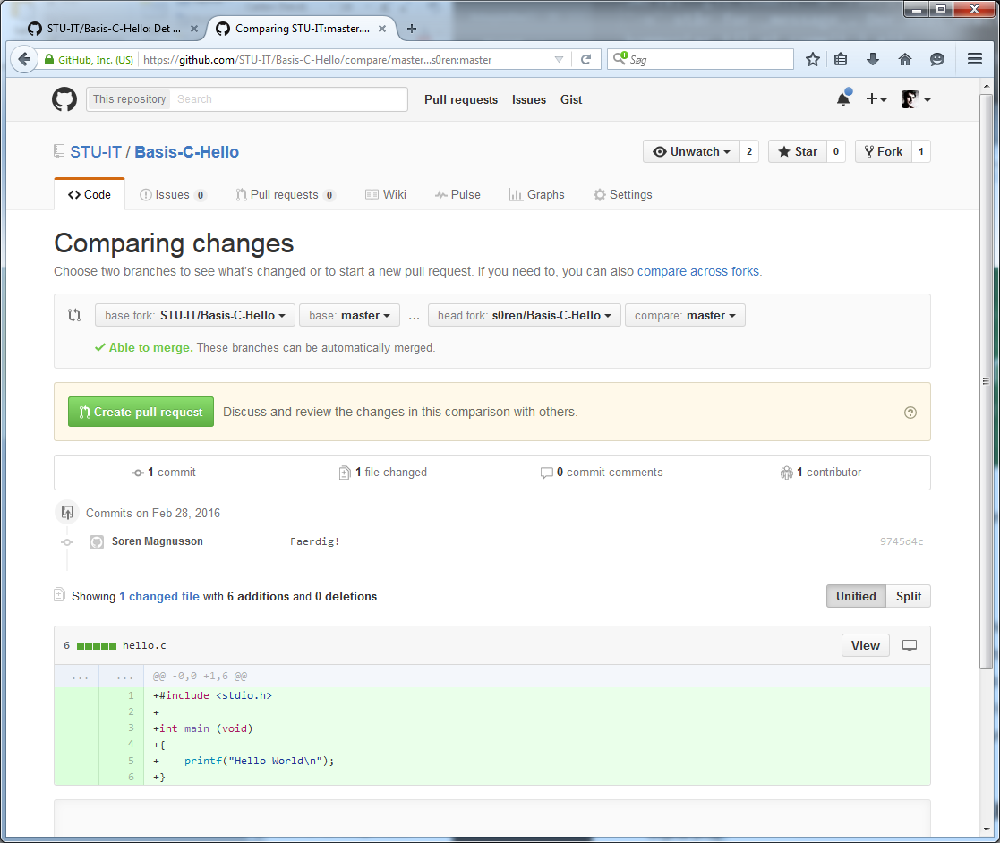
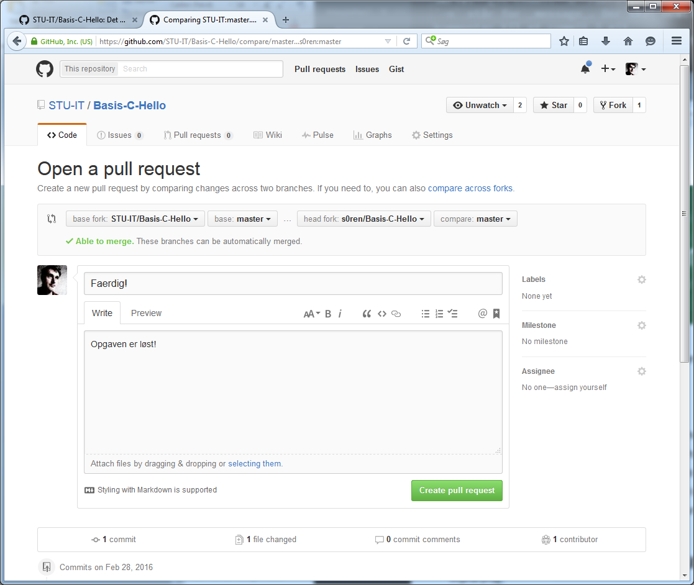
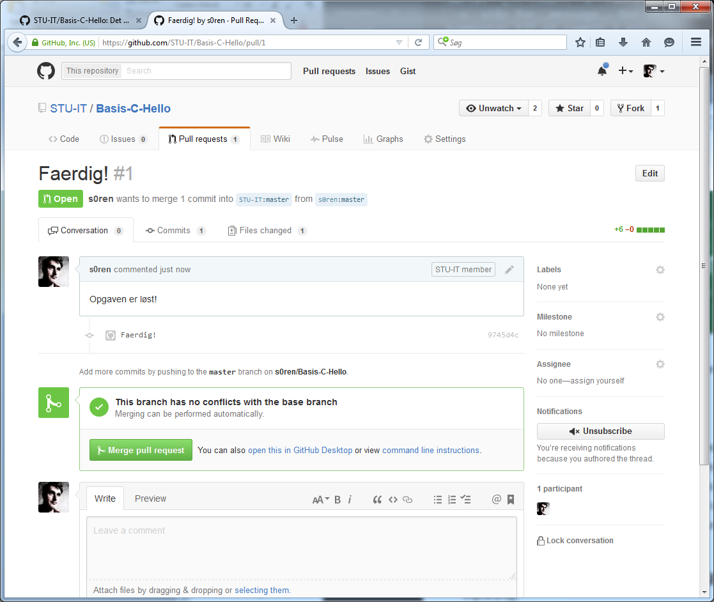

#GitHub vedledning
_CS 50 /linux version_
_ **Hvor dan gør man så med det der git og hub?** _

## Først skal du lave en `Fork`.
På github.org skal du oprette en konto og logge ind.
Find herefter projektet __Basis-C-Hello__ Søg enten på __STU-IT__ eller på __Basis-C-Hello__.


Når du har oprettet dig som bruger, og logget ind, vælger du øverts til venstre, på siden.


Når du har kigget på den sjove animation, har du fået oprettet din helt egen kopi af projektet. Det er den du skal arbejde videre med på din computer. Altså i __CS 50 maskinen__.

## Vi skal Klone
med kommandoe `Clone`.
På min maskine skrev jeg følgende:
`jharvard@appliance (~/basis): git clone https://github.com/s0ren/Basis-C-Hello.git`
og git svarede:
``` 
Cloning into 'Basis-C-Hello'...
remote: Counting objects: 17, done.
remote: Compressing objects: 100% (12/12), done.
remote: Total 17 (delta 6), reused 0 (delta 0), pack-reused 5
Unpacking objects: 100% (17/17), done.
Checking connectivity... done.
```

Herved har git hentet alle filerne, og det skjulte filer der skal til for styre arkivet (repository'et).

For at se indholdet skriver jeg: `ls`
`Basis-C-Hello`
Det er en ny mappe der er blevet oprettet. Den skifter jeg ned i (åbner, om man vil) `cd Basis-C-Hello` og `ls` og nu kan vi se filerne, som vi også kunne se på github.org: 
`LICENSE  README.md`

Jeg opretter, redigerer, afprøver osv. Når jeg er færdig, eller i hvert fald har noget, der noget værd at gemme, skal jeg have det ind i git arkivet, og tilbage på github.

## Konfigurer GIT
Git skal vide hvem der laver ændinger så man skal give et navn og en email. (Brug dit rigtige navn og email. Det er profesionelt det her!)
Skriv: `git config --global user.email smag.tec.dk` 
hvor du selvfølgelig ikke bruger min mail, men dig egen.
Skriv mere:  `git config --global user.name "Soren Magnusson"`
Og nej, du hedder __ *ikke* __ Søren Magnusson

## Add og Commit
Nu kan vi tilføje den nye fil til git.
Skriv: `git add hello.c`
Og, når filen er tilføjet, kan vi "commit'e" ændringerne af filen (den var tom før):
Skriv. `git commit -m "Faerdig!" hello.c`
`-m` står for _message_. Der skal nemlig __altid__ være en kommentar til et commit i git.
__Add__ og __Commit__ er de aller vigtigste kommandoer i git.

## Push
Med __Push__ lægger vi vores ændringer tilbage på github.org.
Skriv: `git push`
og skriv så dit brugernavn eller email til github, når du bliver bedt om det 
`Username for 'https://github.com': s0ren` 
og dit password, bagefter: 
`Password for 'https://s0ren@github.com':`
og lidt efter, ligger det hele på github.org.

## Bed om en tilbagelægning
På github-engelsk, et pull request.
Der er når man foreslår at de ændringer man har lavet i sin __fork__ af projektet, bliver lagt ind i original-projektet.

Her får vi et overblik over ændringerne i filerne som vi har lavet. Forken vs. det originale.

Her kan vi skive en kommentar, og bekræfte pull requestet.

Her kan ejeren af original-projektet se hvilke pull requests der er kommet. Dvs. jeg kan se hvem der har afleveret!


